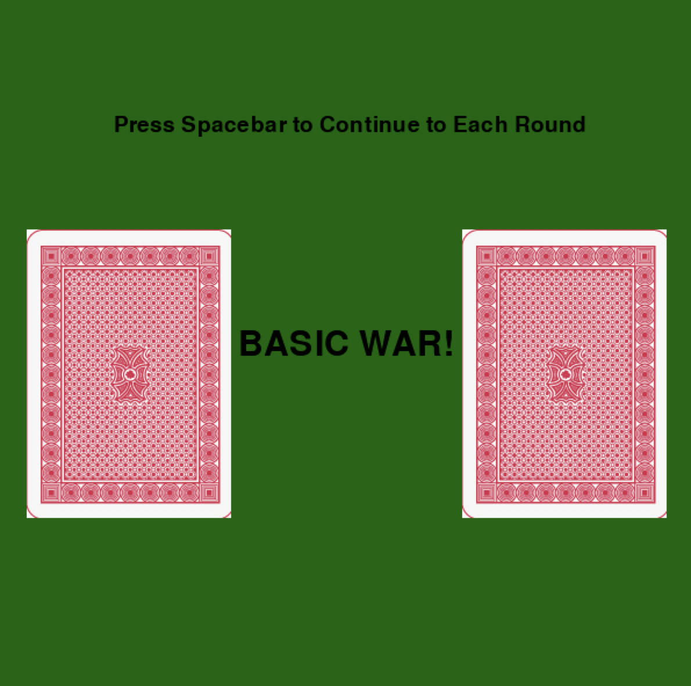
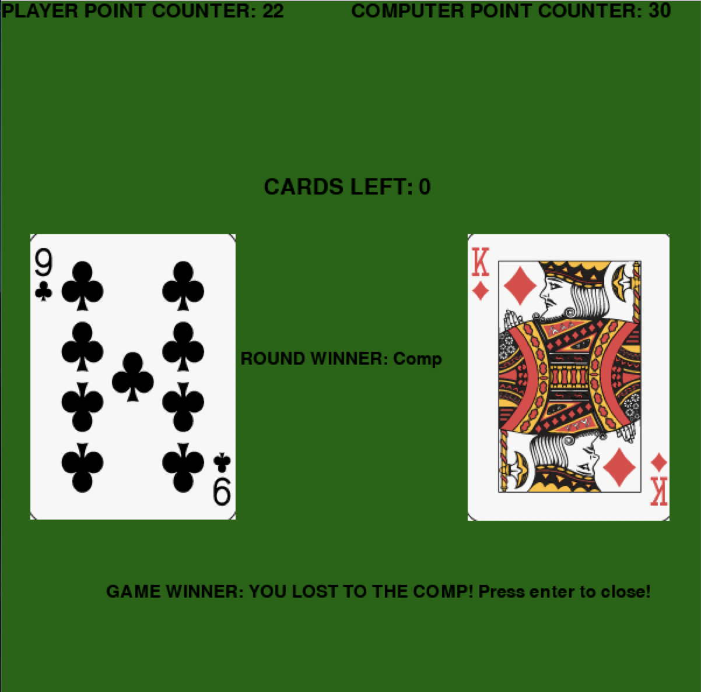

# War


## Contents
    * Description
    * Features
    * Technologies
    * Challenges and Solutions
    * MVP
    * Stretch Goals
    * Screenshots

## Description
This project is built using Python and Pygame. meant to be a basic recreation of the popular card game, "War." 

### Features
* 

## Technologies
* Python
* Pygame

## Challenges and Solutions
* Creating a new card for each round
    *
* Creating an array to store the deck of cards
    *
    ```
    cards = []
    suits = ['h','s','d','c']
    for s in suits:
        for c in range(1,14):
            cards.append(str(c)+s)
    ```
* Game Logic

## MVP
* 

## Stretch Goals
* Create point counter system
* Implement Full "War" Functionality for a tie

## Screenshots
* Main Game


